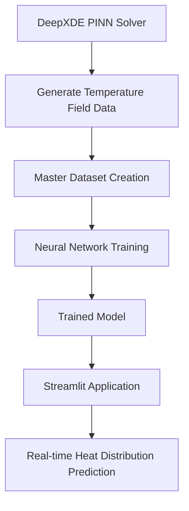

# 2D Heat Distribution Solver using Physics-Informed Neural Networks and Machine Learning

This project predicts the **steady-state temperature distribution of a two-dimensional heat conduction problem** using a trained neural network model.

The system combines **Physics-Informed Neural Networks (PINNs)** and **Machine Learning** to create a fast surrogate solver for the heat equation.

Instead of running expensive numerical simulations each time, the trained neural network can instantly predict the temperature field for new boundary conditions.

---

# Project Motivation

Solving heat transfer problems using numerical methods (CFD, FEM, finite difference) can be computationally expensive when many simulations are required.

To overcome this, a **machine learning surrogate model** is trained to approximate the solution of the heat equation.  
Once trained, the model can predict the full temperature field in **milliseconds**.

---

# Dataset Generation using DeepXDE (PINNs)

The dataset used to train the model was generated using **Physics-Informed Neural Networks (PINNs)** implemented with the **DeepXDE library**.

Steps followed:

1. A highly optimized **PINN model** was developed using DeepXDE to solve the **2D steady-state heat equation**.
2. Multiple simulations were performed with **different boundary conditions**.
3. For each boundary condition, temperature values were generated for a **100 × 100 grid**.
4. The results from each simulation were **appended to a master dataset**.
5. The optimized PINN solver was used to generate a large dataset of temperature fields.
6. This dataset was then used to train a **neural network surrogate model**.

This approach combines **physics-based modeling with machine learning**.

---

# Project Pipeline

DeepXDE PINN Solver  
↓  
Physics-based simulation of 2D heat equation  
↓  
Generate temperature field data  
↓  
Append results to master dataset  
↓  
Train neural network surrogate model  
↓  
Save trained model  
↓  
Streamlit interface for real-time prediction

---

# System Architecture

---

## Model Architecture

**Input:** Boundary temperatures

- Left temperature  
- Right temperature  
- Bottom temperature  
- Top temperature  

**Neural Network:**

Dense(256)  
Dense(512)  
Dense(1024)  
Dense(10000)

**Output:**

100 × 100 temperature field

**Input shape:**

(None, 4)

**Output shape:**

(None, 10000)

The output vector is reshaped into a **100 × 100 grid** to visualize the temperature distribution.

---

## Features

- Predicts full **2D temperature distribution**
- Uses **boundary temperatures as input**
- **Extremely fast predictions compared to CFD simulations**
- Interactive **Streamlit web interface**
- Combines **physics-based modeling + machine learning**

---

## Demo Video

Since the training dataset and trained model are not publicly distributed, the working demonstration of the project can be viewed here:

[VIDEO_LINK_HERE](https://drive.google.com/file/d/1oh-3kYcpz-Nv9FndSIKAxV39w_vfjtl5/view?usp=sharing)

---

## Technologies Used

- Python
- TensorFlow / Keras
- DeepXDE
- Streamlit
- NumPy
- Pandas
- Matplotlib
- Scikit-learn

---

## Repository Contents

This repository contains documentation and explanation of the project.  
The dataset and trained model are **not included** due to file size and research constraints.

Scikit-learn

Repository Contents

This repository contains documentation and explanation of the project.
The dataset and trained model are not included due to file size and research constraints.
